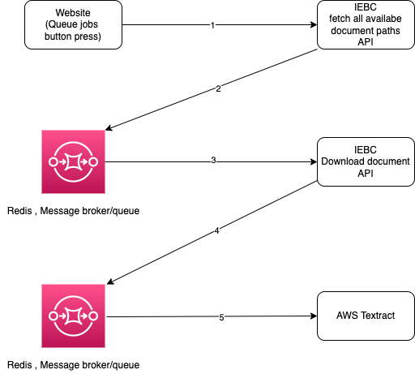

# IEBC tallying


In the web application you can set up a tallying center for the IEBC results which  explores  different technologies i.e  queue and AWS textract



## Quickstart

Clone the repository, cd into it and run
```bash

mkdir data
mkdir data/results
mkdir data/extracted_results_pdfs
```
Put in AWS textract id and keys in the .env.dev file
```
sudo docker-compose build 
sudo docker-compose up -d
```

point your browser to http://localhost:5003. There is also rq-dashboard running on http://localhost:5555

## Docker containers

For each component of this project a separate docker container is afforded, controlled ("orchestrated") by docker-compose.

For the sake of simplicity, the same image is used for the separate containers. The image stems from [python:3.6-stretch](https://hub.docker.com/_/python), which contains a debian 9 linux. Instead of debian a more lightweight image like alpine could also be used.

The are four containers in this project at work.
* server: where are Flask web application runs
* worker: where the RQ worker process runs
* dashboard: where the rq-dashboard monitoring web application runs
* redis: containing the redis server

The image is build from `project/Dockerfile`. This one Dockerfile includes all the necessary python components and their dependencies from `project/requirements.txt`. Because we're using the same image for multiple purposes like the flask application, the rqworker and the rq-dashboard it has to contain all of these components. In an advanced use case you want to build different images which are tailored to their individual purposes.

For the redis server container the out-of-the-box [redis](https://hub.docker.com/_/redis) image is used - not much use building a image for redis by ourself.
